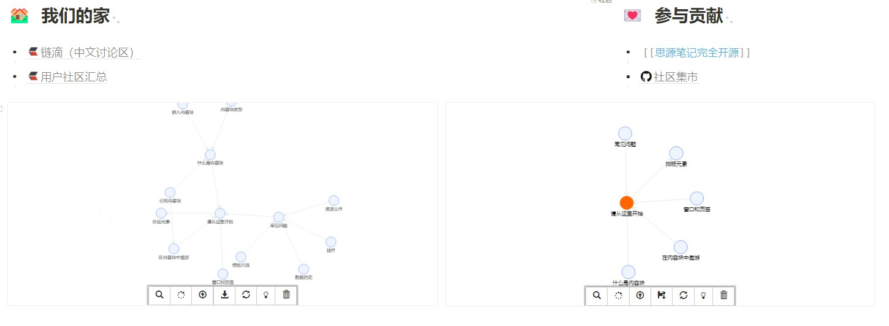

# widget-graph

一个将思源笔记文档正链和反链以图谱方式渲染的挂件

基于G6引擎

如果您喜欢本挂件, 希望为本项目点亮一个⭐!

接触前端不久，欢迎大佬提出改进优化建议

## 预览

## 开始

- 下载源码进入`思源工作空间目录/data/widget/`进行解压 / 已上线集市，直接下载即可使用
- 访问`http://127.0.0.1:6806/widgets/graph/`（建议浏览器访问），或常规`/`唤出挂件使用

# 功能列表

- [x] 布局与美化--持续
- [x] 搜索文档块功能
- [x] 添加节点功能
  - [ ] 手动添加非思源笔记节点，添加手动出链入链
  - [ ] 节点筛选
- [x] 删除单个节点
  - [x] 指定节点删除关联反链（会清空画布上没有连线的节点）
- [x] 添加反链功能
  - [x] 添加正链功能
  - [x] 多层反链添加
- [ ] 节点展示功能
  - [ ] 节点展示缩略信息：别名、命名
  - [ ] 节点类型标注
  - [x] 信息按正链数或反链数排序，最好加在配置文件里面
- [x] 节点右键菜单
- [ ] 操作日志
- [x] 保存数据文件/加载数据文件
- [x] 画布展示
  - [ ] 小地图展示

> 建议PC端单独开浏览器标签页使用，目前未对样式方面做太多优化

## 参考 & 感谢

|作者|项目|许可证|
| :------------------------------------------------------| :------------------------------------------------------------------| :------------|
|**[leolee9086](https://github.com/leolee9086)**|[leolee9086/cc-baselib](https://github.com/leolee9086/cc-baselib)|*Unknown*|
|**[Zuoqiu-Yingyi](https://github.com/Zuoqiu-Yingyi)**|[Zuoqiu-Yingyi/widget-query](https://github.com/Zuoqiu-Yingyi/widget-query)|*Unknown*|

# 待完善问题

- 节点过多时看上去有些乱，后续加个筛选窗口/功能

## 开发调试

- docker run -d -v /files/git/siyuan_dev:/siyuan/workspace -v /files/git/widget-graph:/siyuan/workspace/data/widgets/widget-graph  --name siyuan_dev -p 6807:6806 -u root:root b3log/siyuan:latest --workspace=/siyuan/workspace/
- http://127.0.0.1:6806/widgets/widget-graph/

# 更新历史

## v1.2.0

- 基于思源内部使用方便，调整了页面布局与画布涉及参数
- 添加了图表
- 修复，优化
- 在思源打开挂件时，自动扩展当前文档块的一级关系

## v1.1.0

- 优化全局关系图（添加忽略笔记本参数，可忽略指南）
- 添加节点时自动根据层数扩展节点
- 添加刷新布局（避免一次扩展节点太多，页面渲染过慢，可手动刷新渲染），超级节点高亮（对出线入线多的节点进行突出显示）功能
- 修复反链统计未去重的bug

## v1.0.1

- 全局关系图展示（嗯，这个可有可无，只是临时看一下）
- 回车事件绑定

## v1.0.0

- 完成数据的导入导出
- 可删除节点与连线
- 展示文档信息
- 对连线节点进行颜色标注

## v0.0.1

- 完成关键字检索笔记文档，并对文档进行初步信息展示
- 可对文档进行图层节点添加
- 对节点提供交互
  - 右键添加反链/正链节点
